# Altschool-capstone-project
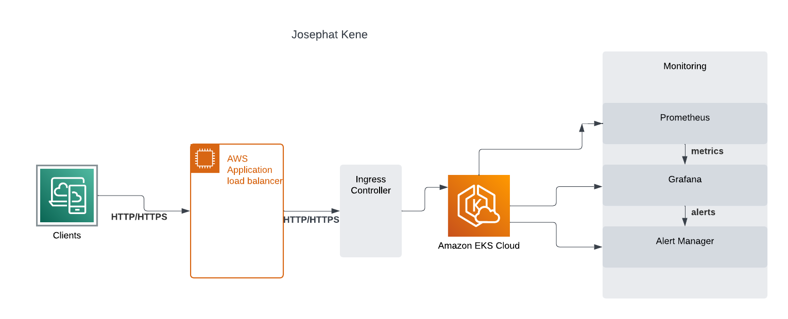

### Deployment of Sock Shop Microservices Application on Kubernetes

This project involves deploying the socks shop application on kubernetes cluster using Infrastructure as a code(Iac) approach. This includes provisioning the necessary infrastructure on AWS using terraform, setting up a deployment pipeline, monitoring the performance and health of the application and securing it.

This project was implemented with Terraform for the provision of infrastructure, GitHub Actions for the deployment pipeline, kubernetes for container orchestration, prometheus for monitoring,

## Projet Requirement
- Terraform
- AWS account
- Kubernetes
- Prometheus and grafana for monitoring
- Let's Encrypt: For
- Helm

## Prerequisites 
- An AWS Account
- Terraform
- GitHub Actions
- Kubernetes
- Prometheus
- sock shop application

## Project Resources

Socks Shop Resources: https://github.com/microservices-demo/microservices-demo.github.io

Demo: https://github.com/microservices-demo/microservices-demo/tree/master

# Project

The main thing needed for this project in the resources is the kubernetes manifest file. Which was gotten from the repository. Another option is to clone the entire repository. 

The next thing is to provision the needed infrastructure. To do that, make sure you have terraform installed and have installed the AWS CLI and configured it.

To provision the infrastruture on AWS which consist of a VPC, Security group, and an EKS cluster by first writing the terraform code. Which is in the terraform branch of this repository.

Then initialise terraform by running the command 
`terraform init`

After than, check the plan of your infrastructure by running the command: 
`terraform plan`

You can also check if the terraform code is valid by running the command:
`terraform validate`

After you are sure the infrastructre to be created is what you want, you provision it with the command:
`terraform apply --auto-approve`

The '--auto-approve' flag is so you won't get any prompt while the infrastructure is being provisioned. 
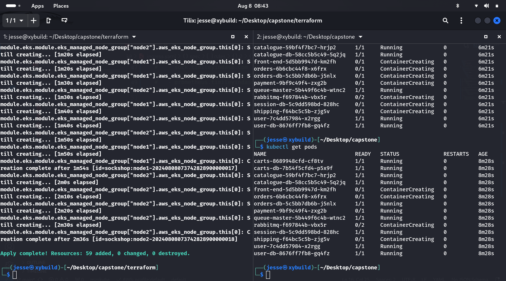

This command help create our instances as seen in the picture below
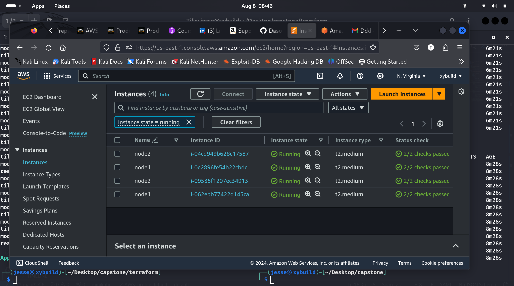

The next step is to make sure your kubectl connected to the EKS Cluster you just provisioned and this is by updating the kube-config file. To do that, run the command:
`aws eks update-kubeconfig --region us-east-1 --name sockshop`
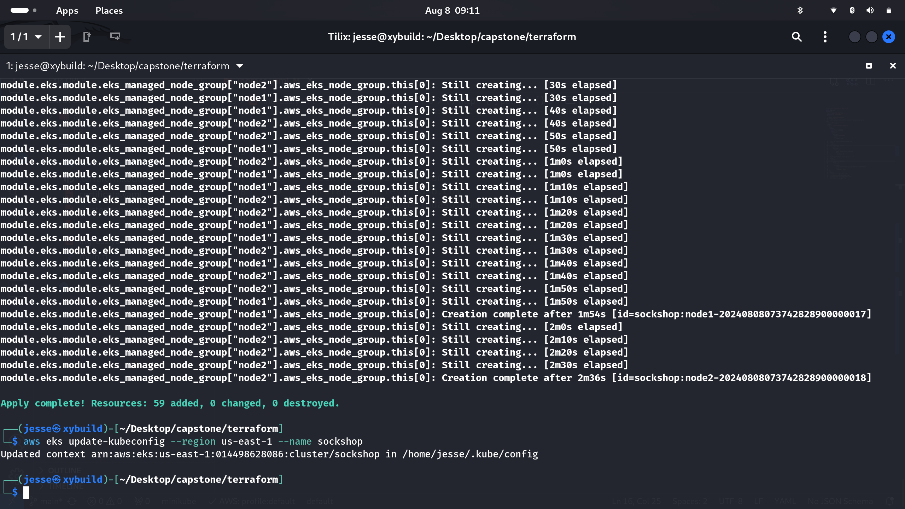

So now you can push the kubernetes manifest into the EKS cluster we created which is in the deployment.yml file. In this repository, it is located in the main branch. Run the command:

`helm install app1 app`


The next thing is to configure default namespace with this command:
`kubectl config set-context --current --namespace=sock-shop`
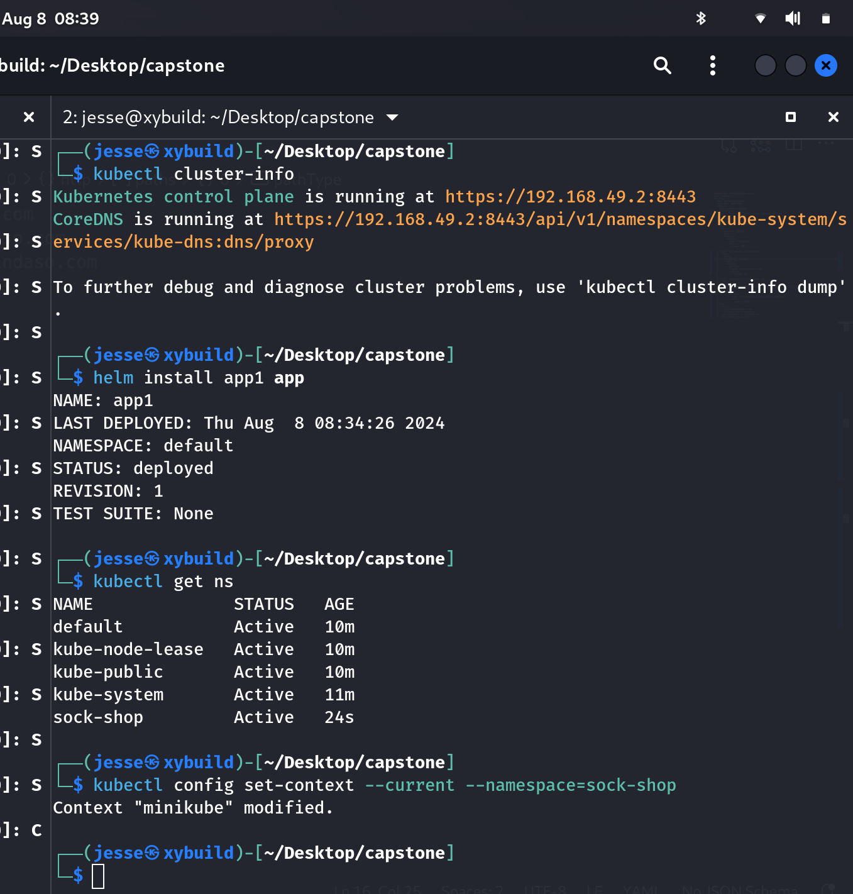
We can check our pods and svc to be sure they are running with the commands:
`kubectl get pods`
`kubectl get svc`
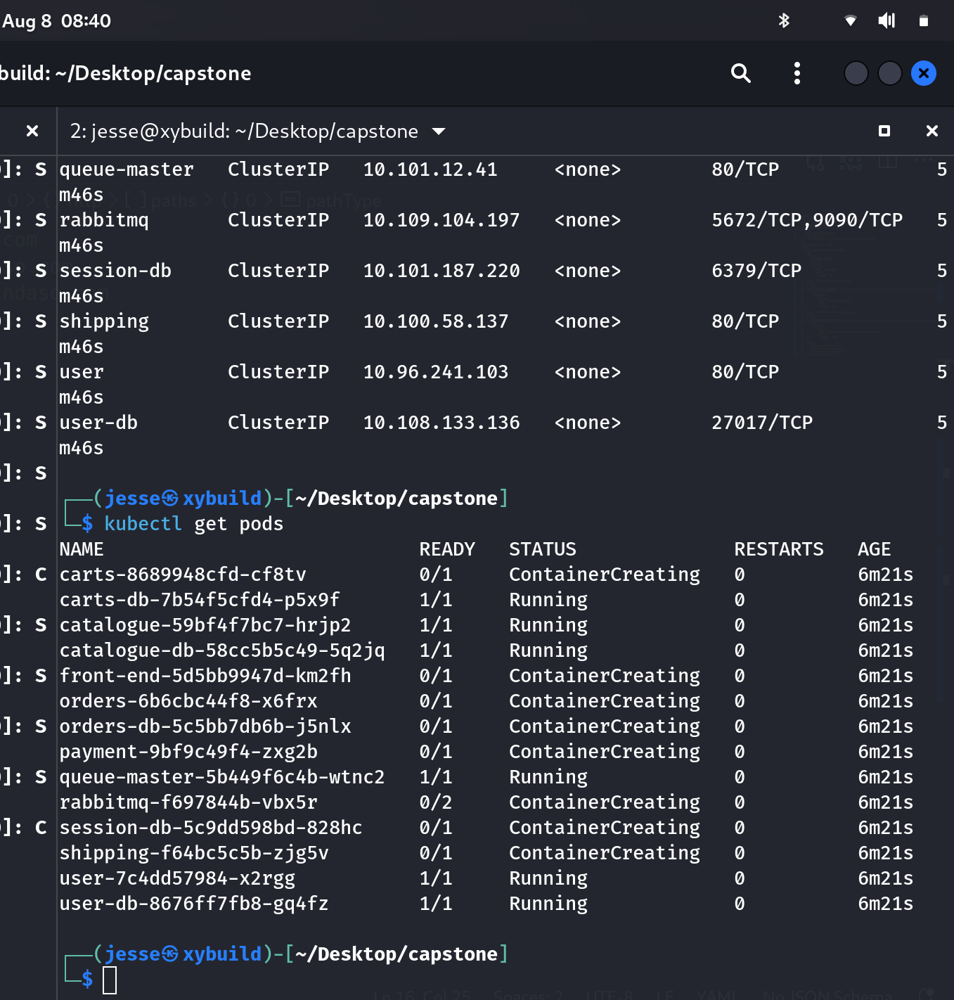
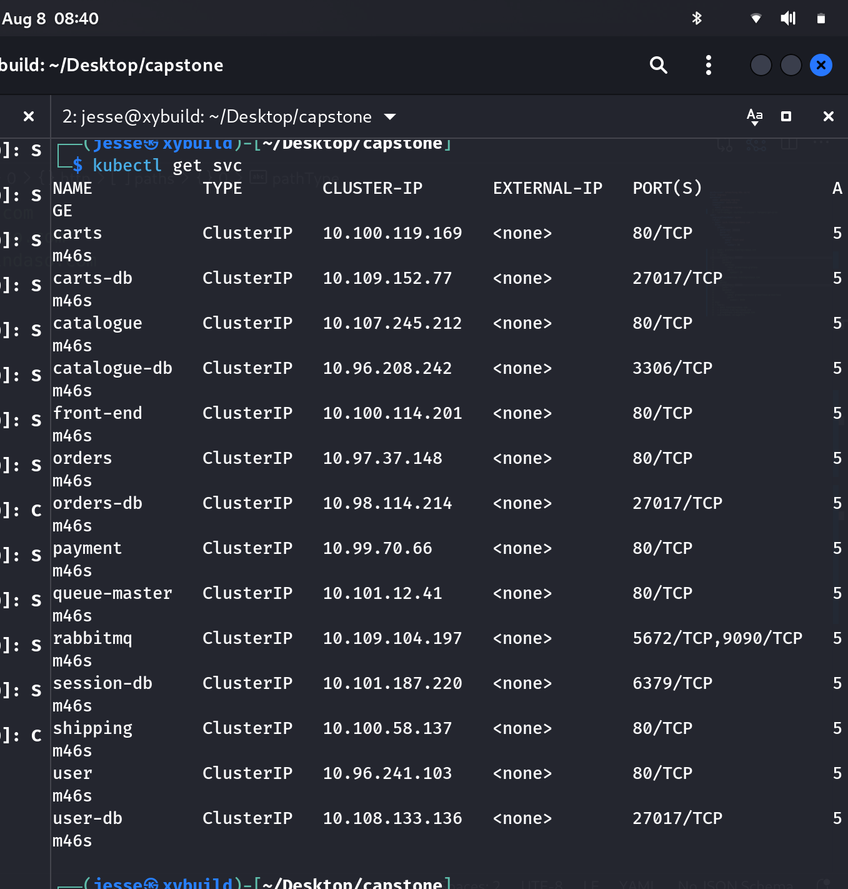

Now that we have our pods and services running on our cluster. We see that our services are pods are not accessible to the users because they all have cluster IPs. So be able to connect to the deployed app in the cluster. To do that, we have to install the ingress controller which creates a load balancer. We do this because it is not easy to create a load balancer on kubernetes. The users connect to the load balancer and it routes traffic to the application/cluster. To do this, we run the command: 
`kubectl apply -f https://raw.githubusercontent.com/kubernetes/ingress-nginx/controller-v1.11.1/deploy/static/provider/aws/deploy.yaml`
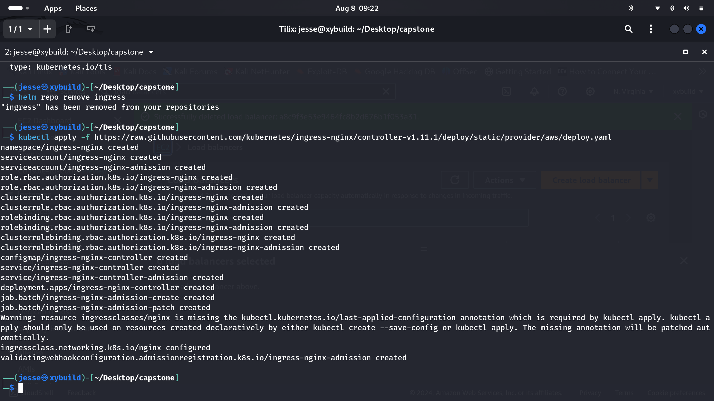


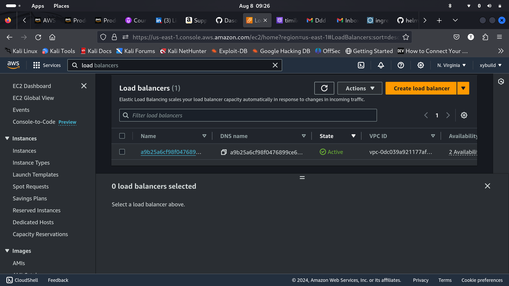

Next is for us to create and apply our ingress file. The ingress file gives us a more simple and flexible way to connect to our cluster. It allows for a single point entry to our cluster as opposed to exposing multiple services seperately. Ingress also allows us to use one load balancer. Without it, each service we want to expose will require it's own load balancer. 

So we create the ingress file and apply with the command:
`kubectl apply -f ingress.yml -n sock-shop`


ideally, if we run the load balancer IP or DNS name on the browser, it wont serve the application. 
But we can resolve that by either connecting it to a domain name or DNS mapping. For this project it was connected to a domain name with an A record and linking the IP address of the load balancer to it.
To get the IP of the load balancer, we use the command:
`nslookup <DNS name of the load balancer>` 
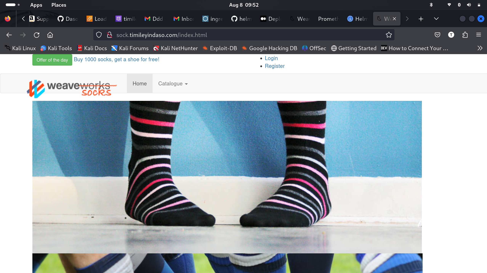

## Monitoring

Prometheus will be used to monitor the performance and health of the Socks Shop application. This will include metrics such as request latency, error rate, and request volume. The Prometheus server will be configured to scrape metrics from the Socks Shop application and store them in a time-series database. Grafana will be used to visualize the metrics and create dashboards to monitor the performance and health of the application.

Now i have the deploy, config and svc yaml files for prometheus, grafana, alert manager, and kube state in this repository and they all can be rendered with port forwarding but i discovered it's easier to use helm to install all those packages with hand it comes with more metrics for the monitoring. 

Helm is a package manager for Kubernetes that provides an easy way to find, share, and use software built for Kubernetes.

First step is to install helm and update with the commands:

```
curl https://baltocdn.com/helm/signing.asc | sudo apt-key add -
sudo apt-get install apt-transport-https
sudo apt-get update
sudo apt-get install helm

```

Next step is to add the prometheus github repo with the command:
`helm repo add prometheus https://prometheus-community.github.io/helm-charts`


Now this repo comes with a lot of charts and we search for the right one with all the packages we need with the command  `helm search repo prometheus` 
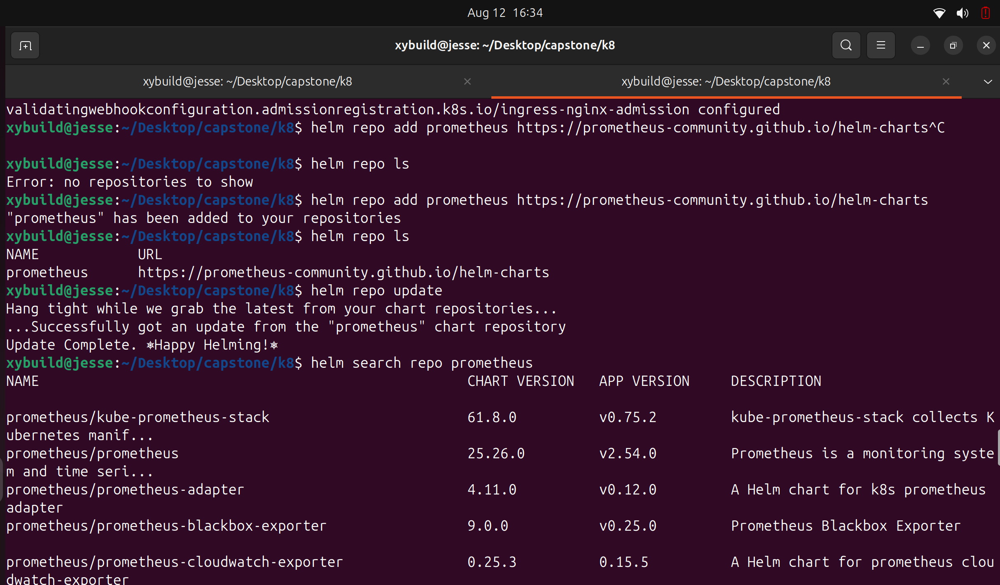

After the particular chart is identified we install it with the command: 
`helm install prometheus prometheus/kube-prometheus-stack`
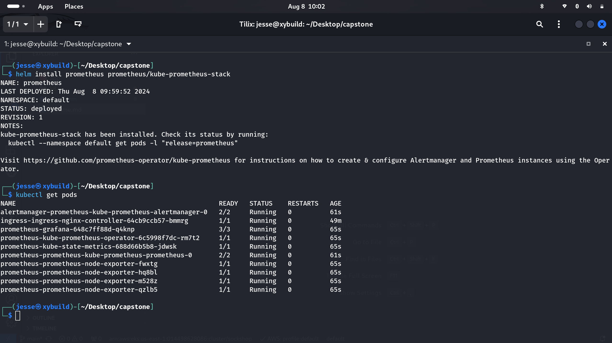


Then we update our ingress.yml file to be able to host the prometheus, grafana and alert manager packages and we apply the ingress file using the details of their services. Then create a CNAME record for each of the services to connect to our load balancer for it to render on our browser. 

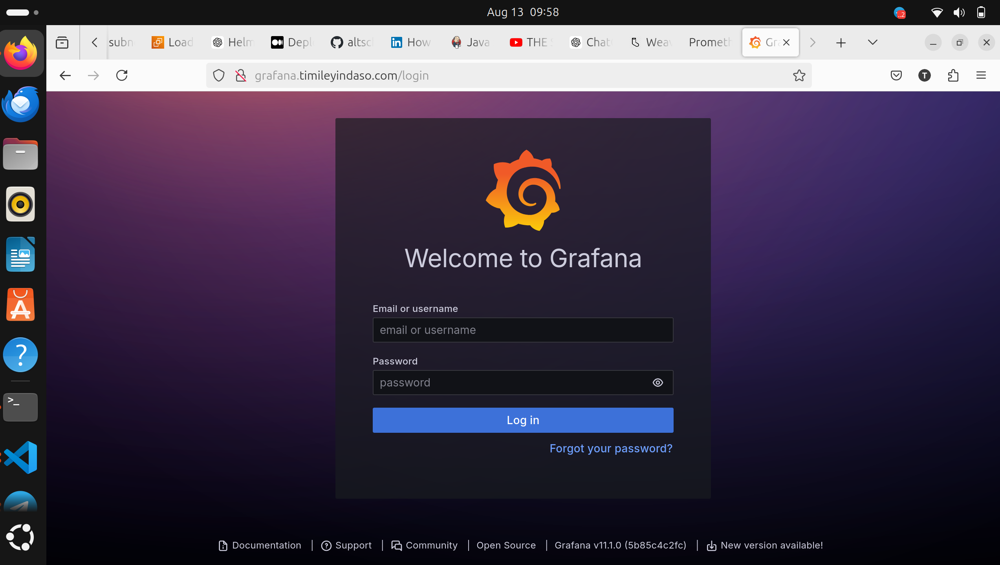
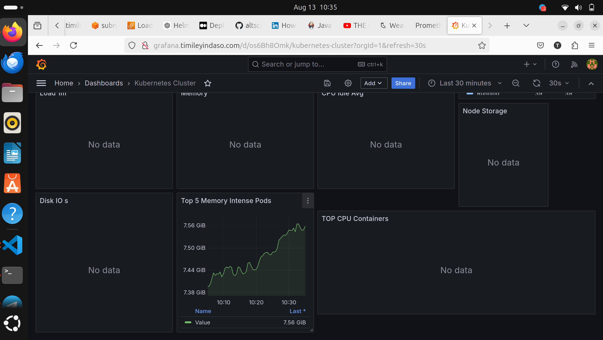

## Security
The application will be secured with HTTPS using a Let's Encrypt certificate. Let's Encrypt is a free, automated, and open certificate authority that provides free SSL/TLS certificates for websites. The certificate will be used to secure the communication between the client and the Socks-Shop application, ensuring that the data is encrypted and secure.

First we create a namespace called cert-manager with the command:
`kubectl create namespace cert-manager`

Next step is to apply a YAML file that contains the necessary Kubernetes manifests in github (like Deployments, Services, and CRDs) to install cert-manager in your cluster.
`kubectl apply -f https://github.com/cert-manager/cert-manager/releases/download/v1.15.2/cert-manager.yaml` or the file below
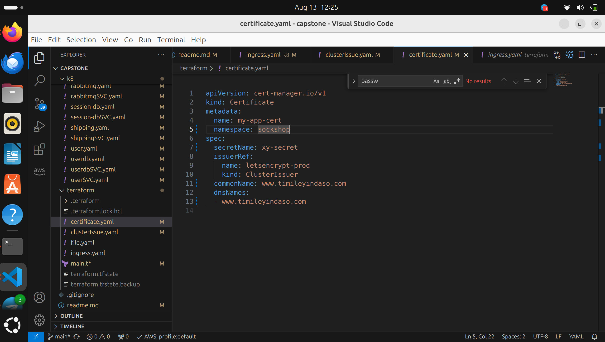
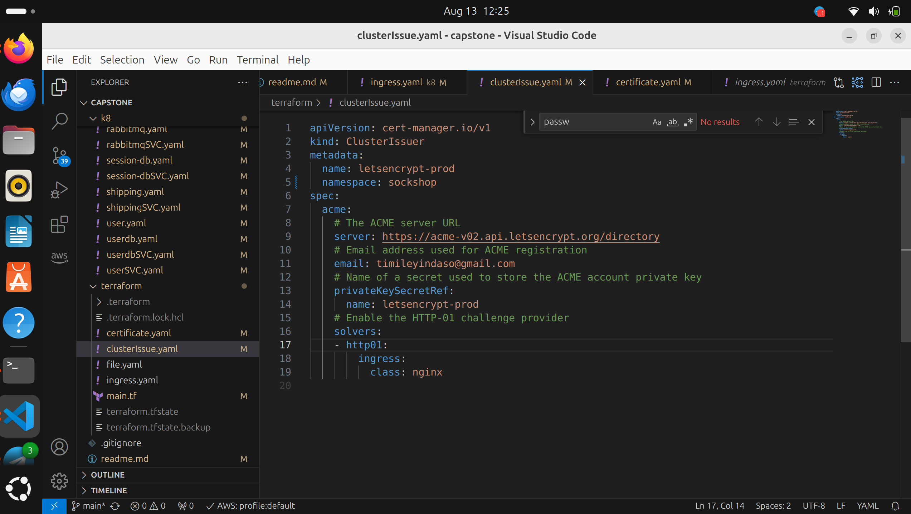

Next is for us to create and apply our Cluster issuer and certificate YAML files and confirm if our SSL certificate was issued


Then we update our ingress file with the tls record and annontations. And we apply the ingress file. 
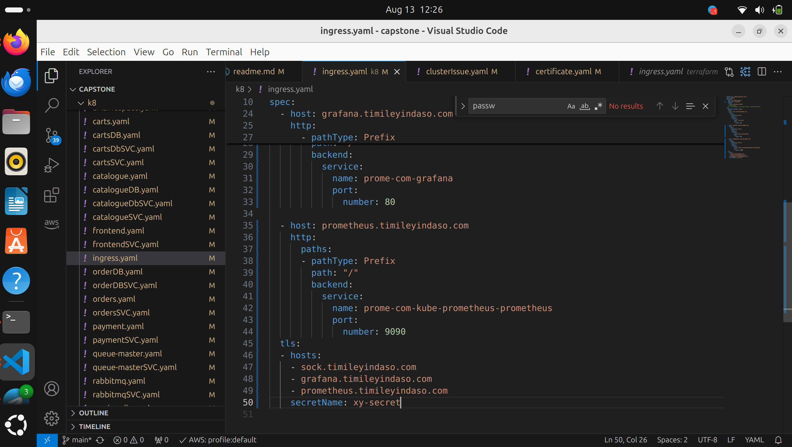

## Conclusion
This project provides experince of implementation of dev ops to an application. Using tools like terraform of infrastructure provisioning, kubernetes, Security, package management with helm, monitoring and CI CD pipeline.

By the end of this project you will have fully deployed an application with all of dev ops best practices. 


